# RoutingStar⭐

> 안녕하세요! 서울 3반 9팀(흐뭇하구 조)의 공통 프로젝트 '루팅스타'를 소개합니다!
>
> **프로젝트 개요**와 **서비스 사용**에 대해 간략히 정리해두었으니 이해에 도움이 되셨으면 좋겠습니다.

 
 
 
 
 
 


## Contact :green_book:

김유진 [Github](https://github.com/yuzin9712) 

김명준 [Github](https://github.com/edkim3275)

김동찬 [Github](https://github.com/DongChanKIM2)

이현경 [Github](https://github.com/hyunohenn)

최다윗 [Github](https://github.com/dawit95) 


## 1. 팀 소개 👨‍💻

- **FrontEnd**

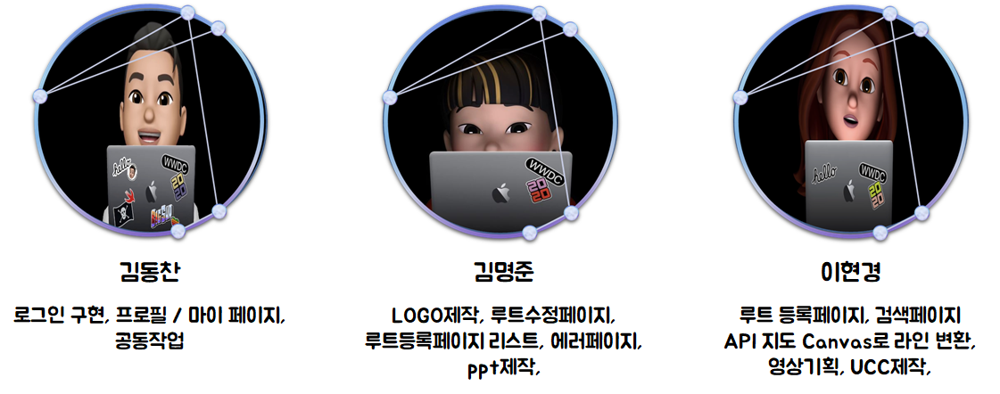

- **BackEnd**

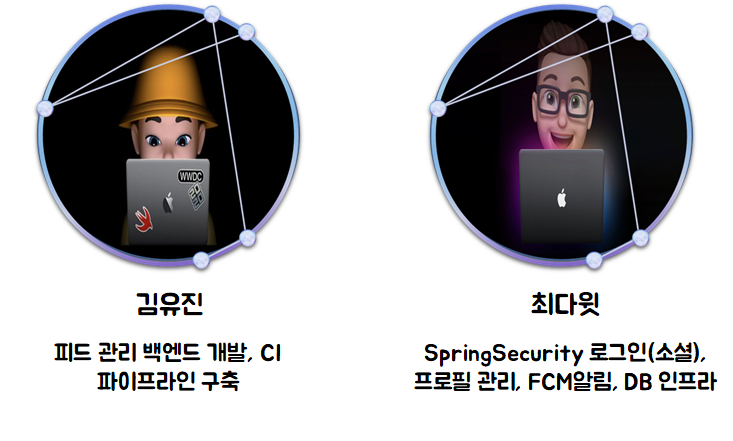

<br>

## 2. 개요 :books:

> 아이디어 도출 과정

### 2.1. 기획의도(Why)

1. **나에게 특별한 장소**


파리 에펠탑, 뉴욕 센트럴파크... 이러한 유명 명소만이 의미가 있는 장소일까요? 

우리 **동네의 맛집**과 **산책길**과 같은 나만의 **추억이 담겨져있는 곳** 또한 **의미있는 장소**가 될 수 있지 않을까요

2. **소규모 점포 소개**

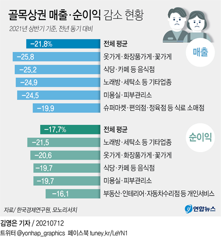

대형 포털이나 SNS에 노출되지 않은 소규모 점포들을 소개하면서 우리 서비스가 소상공인들로 하여금 코로나 등 급격한 변화에 대응할 수 있도록 도와주는 SNS 역할을 할 순 없을까요?

### 2.2. 사용자 페르소나(for Whom)

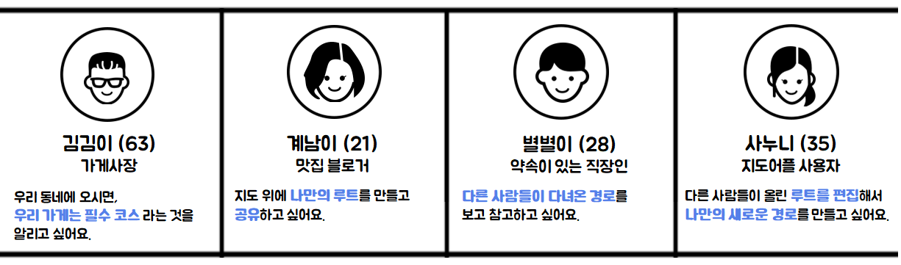

- 동네의 특색과 본인의 가게를 홍보
- 자신만의 루트를 가지고 싶어하며 공유하고 편집하고 싶음
- 낯선 지역의 경로를 알 수 있도록 참조하고 싶음

### 2.3. 서비스 시나리오(What)

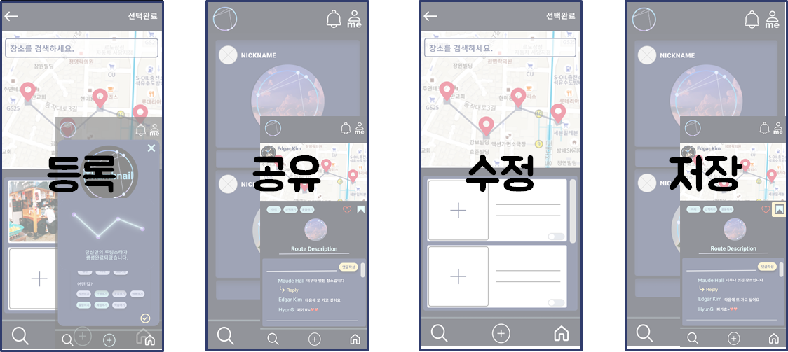

<br>

## 3. 프로젝트 구조 :building_construction:

> 기술스택 및 프로젝트 사용방법

### 3.1. 기술스택

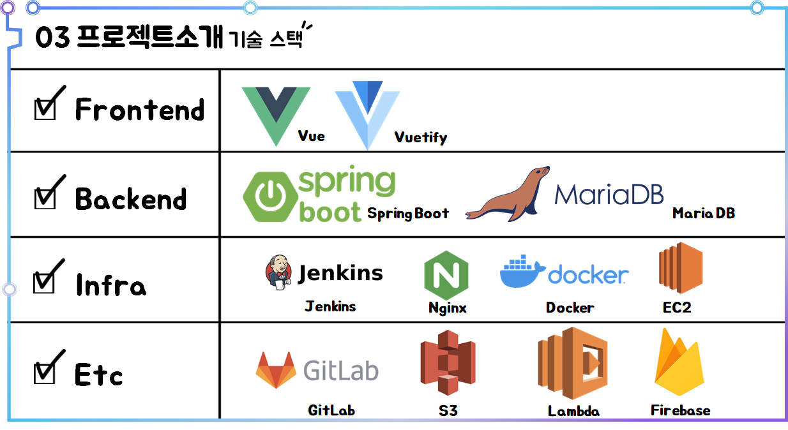

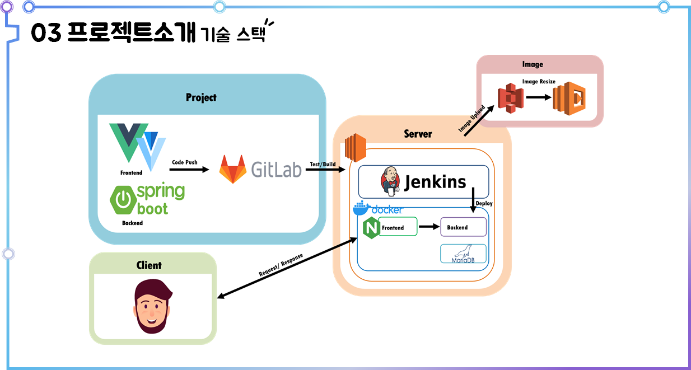

### 3.2. 사용방법

#### 3.2.1. FrontEnd

- Project Setup

  ```bash
  $ npm install 
  ```

- Compiles and hot-reloads for development

  ```bash
  $ npm run serve
  ```

#### 3.2.2. BackEnd

- Project Build

  ```bash
  $ ./gradlew build 
  ```


## 4. 기능소개 :star2:

> 서비스 메인 기능소개

### 4.1. 로그인 페이지

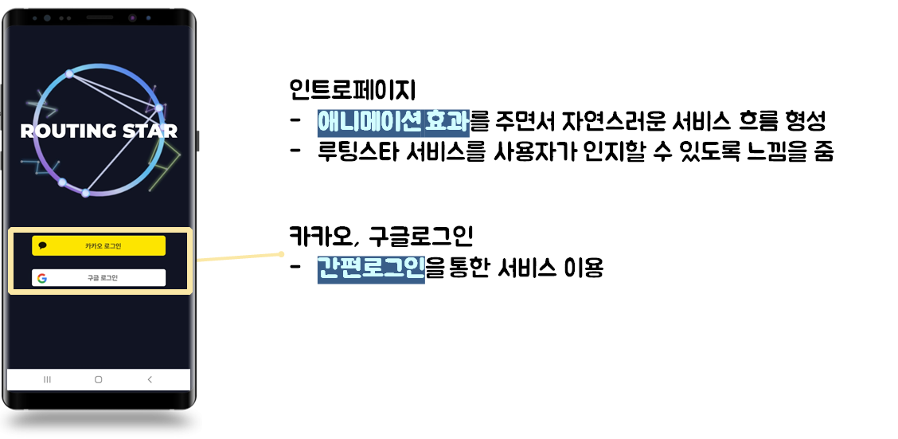

### 4.2. 메인 페이지

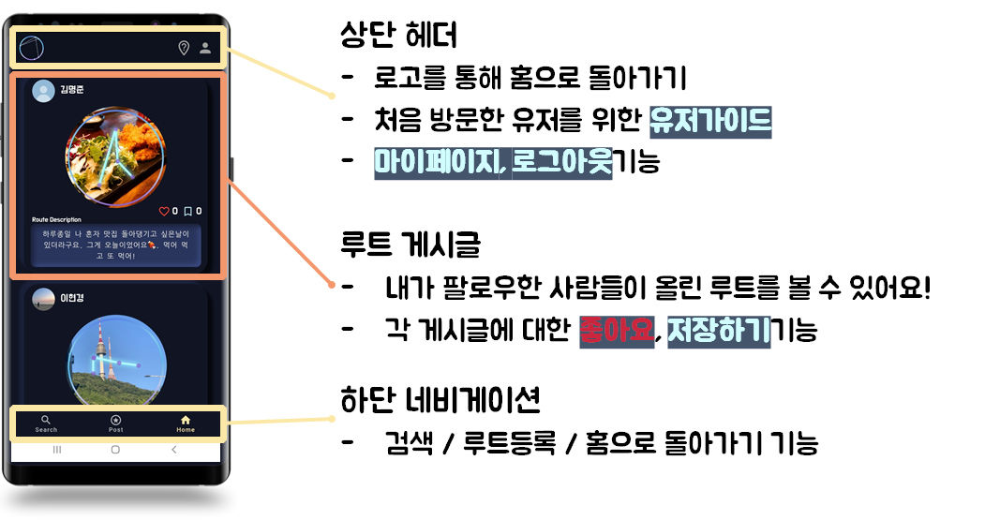

### 4.3. 디테일 페이지

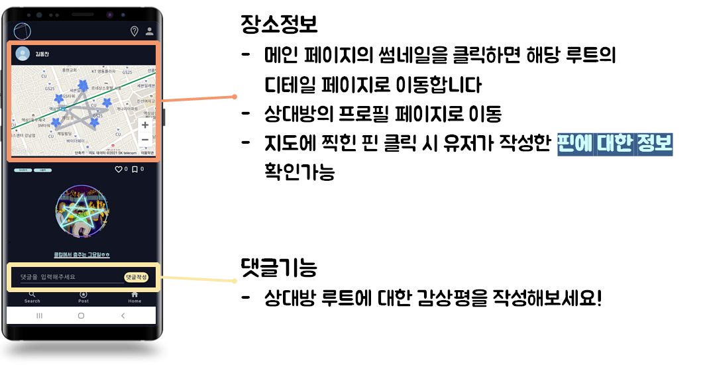

### 4.4. 검색 & 검색 결과 페이지

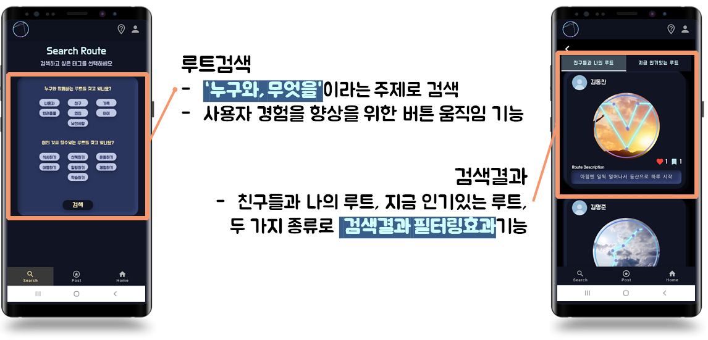

### 4.5. 등록 페이지

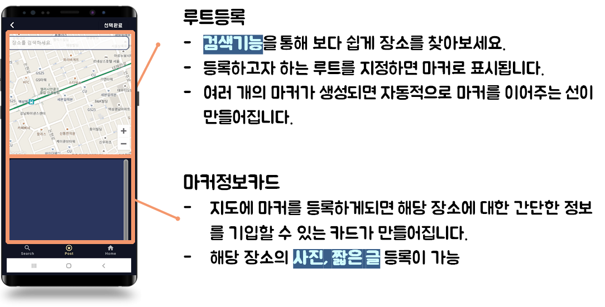

### 4.6. 상세 등록 페이지

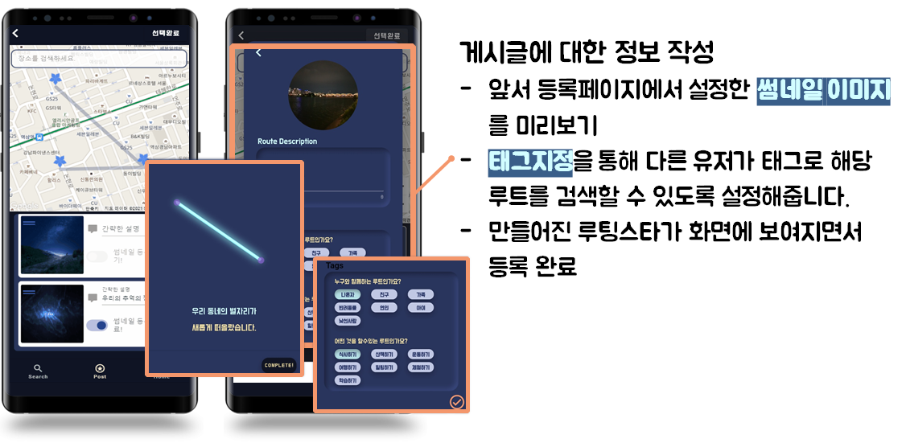

### 4.7. 프로필 페이지

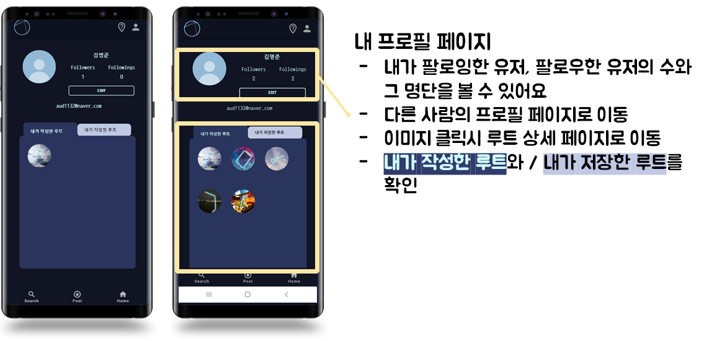

### 4.8. 수정 페이지

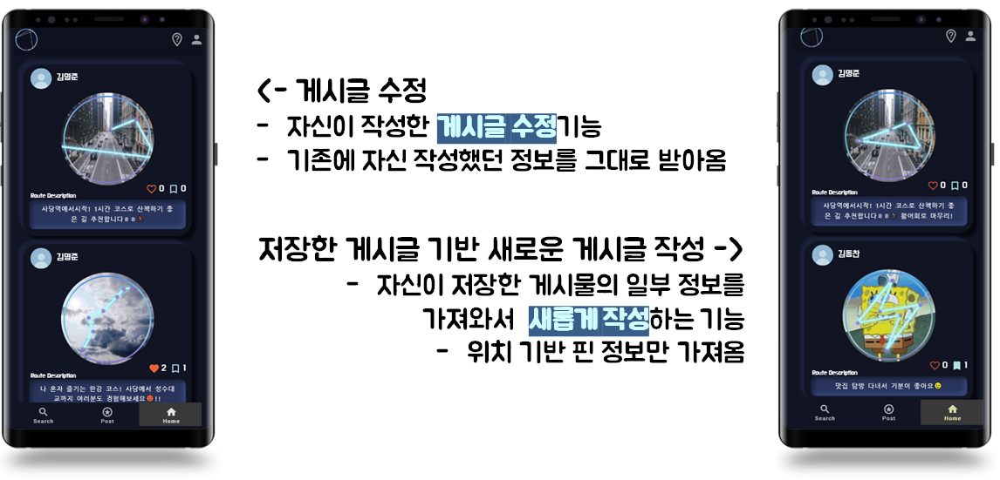

### 4.9. 유저 가이드

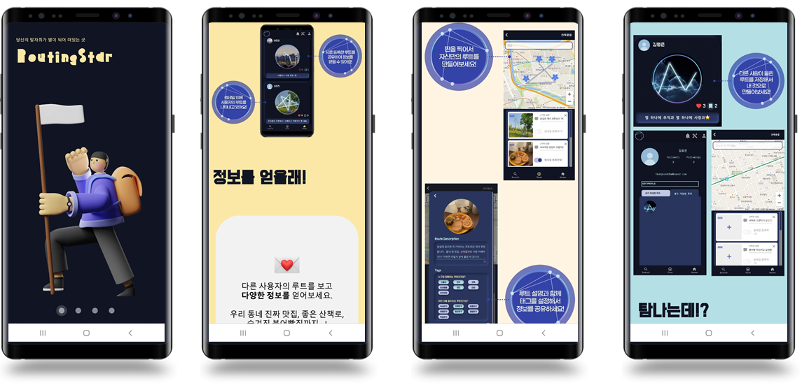

### 4.10. 알람

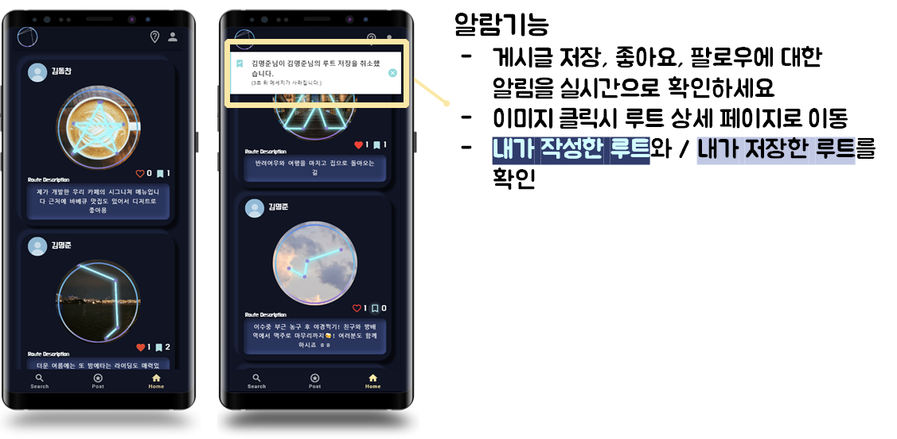


### Tech log :bookmark:

<ul>
<a href="https://www.notion.so/a3e006a561bb44528b8c927ca6249e6a"><li>커밋 규칙</li></a>
<a href="https://www.notion.so/20371383a0c4499bb46fcf00fd8a69d1"><li>코딩 컨벤션</li></a>
<a href="https://www.notion.so/3c751a1b2a944c60b5c4c172d5baed13?v=6c8ff3536329489483707cd026b16a14"><li>도움이 되는 자료들</li></a>
<a href="https://www.figma.com/file/PzJPx18d8pny3MVhGNpZyR/Routing-Star?node-id=194%3A67"><li>와이어프레임</li></a>
    </ul>
- ER 다이어그램

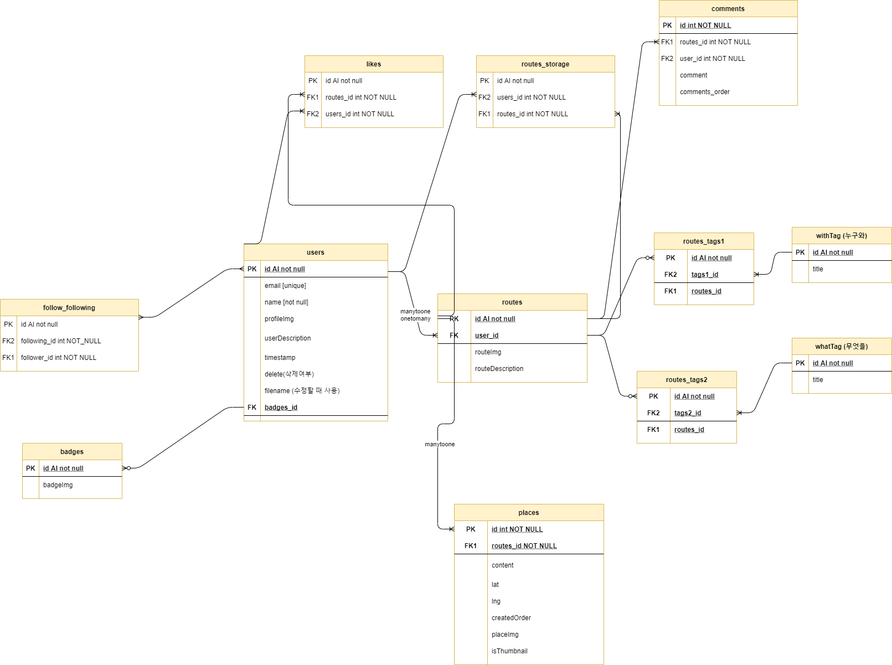
